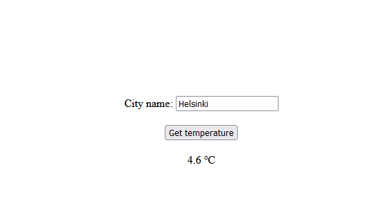

# Group Activity

> Work in group to solve the task below. 

> The complete source code is in` App.js` file. You can compare your work at the end of the activity.

## Exercise

We will use the useState hook to create a controlled form component. At the end of this exercise, you should have the outcome shown in the `weather.png` and be able to type a city name and display its current temperature from [Openweather API](https://openweathermap.org/). 



1. To get started, first install create-react-app and then follow these steps:
2. Select all the files in the src folder and remove them all. We are going to create our own files.
3. Create a new file called index.js in the src folder and add the following code:
```js
import ReactDOM from 'react-dom/client'
import App from './App'
ReactDOM.createRoot(document.getElementById('root')).render(<App />)
``` 
4. let's create a CSS file and add styles. In the src folder, create a file called App.css and add the following code:
```css
body {
  margin: 0;
}

.page {
  align-items: center;

  display: flex;

  height: 100vh;

  justify-content: center;

  width: 100vw;
}

.box {
  display: flex;

  flex-direction: column;
}

.weather-button {
  display: block;

  margin: 20px auto 0;
}

.temp {
  padding: 20px;

  text-align: center;
}
```
5. In the src folder, create another file called App.js and import React and the CSS file we created earlier. Also add some boilerplate code:

```js
import './App.css';
const App = () => {
  return <div>App page</div>;
};

export default App;
```

6. Let's add JSX code to display the form and the initial temperature, which will be 0. First, add the page wrapper with the class name page. Inside the page wrapper, add another wrapper called box. The box wrapper will align the form and the output of the temperature in the middle horizontally and vertically. Inside the box wrapper, add a form (with the class name weather-form) with an input field and a button (with the class name weather-button). Below the form, add a div element with the class name temp:
```js
import './App.css';

const App = () => {

  return (

  <div className="page">

   <div className="box">

    <form className="weather-form">

      <label htmlFor="city">City name: </label>

          <input type="text" id="city" placeholder="Type a city" /></label>

      <button className="weather-button">Get temperature</button>

    </form>

    <div className="temp">

      0 &#8451;

    </div>

  </div>

</div>

  );

};

export default App;
```

7. Before we fetch any data, let's create a controlled form component, to get the city name from the input field. By using the controlled form component, our React components will control the input field and store the value from the input field to a state.

8. To do that, use the useState hook. Let's import the hook first and then declare a new state variable called city.

9. Update the city value when we make changes in the input field, and we are going to use the updated city value for the input field value. This step will allow you to update the city value while typing text in the input field so that we can use it when fetching data:
```js
import React, { useState } from 'react';

import './App.css';

const App = () => {

  const [city, setCity] = useState('');

  return (

  <div className="page">

  <div className="box">

    <form className="weather-form">

      <label htmlFor="city">City name: </label>

           <input type="text" id="city" placeholder="Type a city" value={city} onChange={e => setCity(e.target.value)} />

      <button className="weather-button">Get temperature</button>

    </form>

    <div className="temp">

      0 &#8451;

    </div>

  </div>

  </div>

  );

};

export default App;
```

10. 
- To fetch data, install Axios by running  `npm install axios` command from your terminal, 
- To use Axios, let's import the library: `import axios from 'axios';`

11. Add the onSubmit attribute to the form element and add a reference to a function called submitForm. We are going to fetch data when submitting the form:
```html
<form onSubmit={submitForm} className="weather-form">
```

12. Create new function called submitForm above the return method and receive the event. Firstly, add e.preventDefault();. By default, when you click on the submit button in a form, the browser will be reloaded. When the browser is reloaded, our React app will be restarted, which means all our previously stored values in a state will be lost. To prevent this from happening, we are going to add e.preventDefault();:
```js
const submitForm = e => {
  e.preventDefault();
};
```

13. Now let's fetch data. To get the current temperature of the city, we are going to use the API from https://openweathermap.org/current. So, the API should look like this:
https://api.openweathermap.org/data/2.5/weather?
  q=city-name
  &appid=your-api-key
  &units=metric

We are going to send three values parameter values:

- q: The city name that we will get from the city state updated by setCity
- appid: Your API key, which can be found on the API keys page.
- units=metric: Receiving values in the Celsius scale.

Now we can get the city name so the endpoint should look like this:

https://api.openweathermap.org/data/2.5/weather?q=${city}&appid=your-api-key&units=metric

> If you don't have an api key, you can register or use my key for this lab:
https://api.openweathermap.org/data/2.5/weather?q=${city}&appid=35e7798da3a6b15be336c4db70f936b4&units=metric

14. Let's fetch the data using Axios. Use the GET method, and let's see what data we are getting back:
```js
const submitForm = e => {
  e.preventDefault();
  const url = `https://api.openweathermap.org/data/2.5/weather?q=${city}&appid=your-api-key&units=metric`;

  axios.get(url)
    .then(res => {
        console.log(res);
        setTemp(res.data.main.temp);
  })
};
```

15. We can retrieve the temperature from data.main.temp.

Declare a new state called temp with the default value 0, and update it in then() method. Finally, let's replace 0 to {temp} to display the temperature:

16. Let's search Helsinki to get the current temperature.

## Ref
- The React Workshop: Brandon Richey etc. 